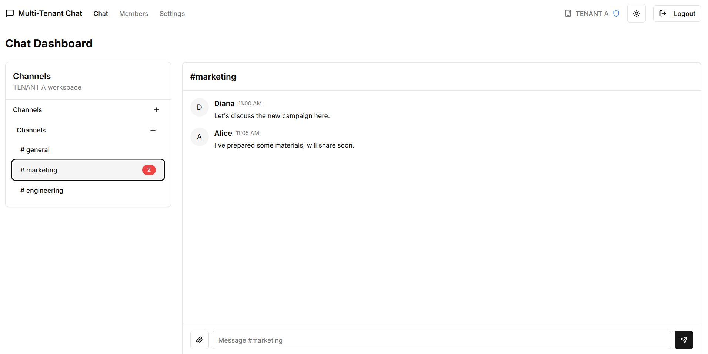

[](http://localhost:8080/swagger/index.html)

## Multi-Tenant Chat System: Stream, Go, Next.js, Neon Serverless



This is a  multi-tenant chat system that demonstrates best practices built with [Stream Chat SDK](https://github.com/GetStream/stream-chat-go) and [Go](https://golang.org/). The database is PostgreSQL with Neon serverless. The frontend is built with [Next.js](https://nextjs.org/).


## 🚀 Getting Started

### 1. Clone the Repo

```sh
git clone https://github.com/Tabintel/multi-tenant-chat.git
cd multi-tenant-chat
```

### 2. Install Dependencies

- **Backend:**
  ```sh
  cd backend/cmd
  go mod tidy
  ```
- **Frontend:**
  ```sh
  cd frontend
  npm install
  ```

### 3. Set Up Environment Variables

- **Backend:**  
  Create an `.env` file in the `backend/cmd` directory, copy the details in the [env.example](env.example) and fill in your values:
  ```
  DATABASE_URL=postgresql://<username>:<password>@<host>/<database>?sslmode=require
  STREAM_API_KEY=your_stream_api_key
  STREAM_API_SECRET=your_stream_api_secret
  JWT_SECRET=your_jwt_secret
  ```

- **Frontend:**  
  (No `.env` is required by default. If you add API keys or environment variables for the frontend, create a `.env.local` file in the frontend directory and document the required variables.)

### 4. Run the App

- **Backend:**
  ```sh
  cd backend/cmd
  go run main.go
  ```
- **Frontend:**
  ```sh
  cd frontend
  npm run dev
  ```

### 5. API Documentation (Swagger UI)

Once the backend server is running, you can access the interactive API docs at:

[http://localhost:8080/swagger/index.html](http://localhost:8080/swagger/index.html)

Use this interface to explore and test all available endpoints.
